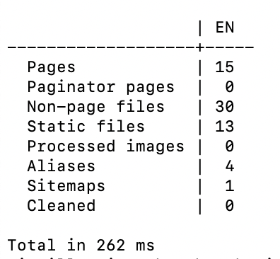
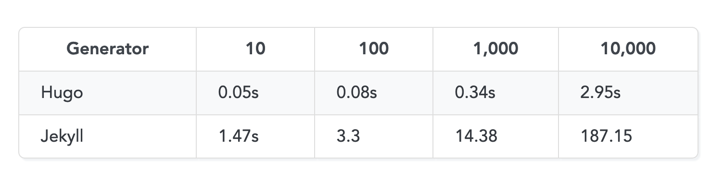
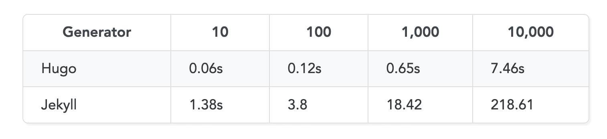

# README 

[Hugo](https://gohugo.io/) is an open source static site generator implemented in golang. According to Hugo's website, it is the world's fastest framework for building sites.

This repo has scripts for benchmarking how fast hugo really is. The test results are generated as csv.

The main goals are to:
- measure how fast hugo really is, compare it to other site generators, 
- compare the different versions within hugo, to see if changes over time are slowing it down,  
- measure the efficiency of optimizing a theme and tweaking build parameters.


A fun side goal is to measure the impact of that speed on savings in CO2 emissions. This is applicable for really large scale projects like building all of github pages by using hugo instead of jekyll.   

**Operating system:**  
The scripts will not work on Windows. They were tested on macOS (bash and zsh) and Ubuntu.

# What's in this directory?

- `sample-content/`: a directory with a sample post and 5 images. It is meant to represent an "average" post. It can be modified to test for a different type of content.  
- `generate.sh`: a script that generates content for the test. It prompts the user how many times they want to clone the `sample-content` directory.  
- `content/posts`: this directory is dynamically created by `generate.sh`. It has the dummy content usually in the thousands of posts. It is always in `.gitignore`.   
- `benchmark`: this is what's actually getting benchmarked: a hugo site, configuration, content and theme. The theme is very minimal to make sure very few things get in the way of an optimal build time.  
- `run_test.sh`: the script that runs the test and captures the output in csv format.
- `data/`: where the csv results are. Includes speed results and details of machine. also in `.gitignore`

# How to run 


**TLDR**:

Make sure scripts are executable (one time only):
- `chmod +x generate.sh`
- `chmod +x run_test.sh`


Make sure your hugo installation works (one time only):
- `cd benchmark`
- `git submodule init`
- `git submodule update`
- `hugo`
- check if hugo build worked
- `cd ..`


then

- `./generate.sh`
- `cp -R content/ benchmark/content/`
- `./run_test.sh`

---
## Details 

### Step 1: Generate dummy content

Generate dummy content by running the script `generate.sh` . It will prompt you to enter how many copies you want. 

The script will take whatever is in `sample-content` and clone it x number of times and save the output to `content/posts`

Make sure the script has the right permissions then run it by using the following commands:  

- `chmod +x generate.sh`
- `./generate.sh`

The target directory where the files are generated is `content/posts`. It is in `.gitignore` to avoid pushing all sorts of random content to github.

### Step 2: Check your hugo install

Make sure you have hugo running and double check that the theme is working.

- `cd benchmark`
- `git submodule init`
- `git submodule update`
- `hugo` or `hugo server`

### Step 3: run test

Copy the content you generated in the previous step from `content/posts/` to `benchmark/content/posts`. 

The files were not generated in the working directory of hugo to allow for troubleshooting and testing hugo independently.

The commands are: 

- `cp -R content/ benchmark/content/`
- `chmod +x run_test.sh`
- `./run_test.sh`

The script `run_test` will prompt you for:
- how many times you want to run `hugo build`. 
- time to wait between the runs.

The time it takes for a build changes slightly between runs even on the same machine. Also, multiple runs let you capture caching effect.  

The time to wait between runs lets your machine cool off and eases the pressure off the memory. It creates more "fair" measurments.

The output is saved as a csv. It contains the build time and the specs of the machine.

#### Hugo output:  

  

#### CSV file:  

Columns:  
- datetime
- cpus
- cpu-type
- free-ram
- pages
- paginator-pages
- static-files
- non-page
- total-time


CPU count was generated with:  
```bash 
cpus=$(getconf _NPROCESSORS_ONLN)
```

CPU type and free ram were generated with: 

``` bash 
os=$(echo OSTYPE)
if [ "$os" = "linux-gnu" ]; then
    cpu_type=$(cat /proc/cpuinfo | grep 'model name' | uniq | grep -o "CPU.*")  
    free_ram=$(free -m  | grep ^Mem | tr -s ' ' | cut -d ' ' -f 4)   
else
    cpu_type=$(sysctl -n machdep.cpu.brand_string)  
    free_ram=$(top -l 1 | grep PhysMem: | awk '{print $6}')  
fi
```

Double check these commands when the script runs on different operating systems or releases.

# Existing benchmark

Existing benchmark do say that hugo is pretty fast. But it is unclear what the specs of the machine used in building were or which version.

### Hugo vs Jekyll benchmark
https://forestry.io/blog/hugo-vs-jekyll-benchmark/

**Simple posts**
Posts included a title, date and lorem lipsum.


**Posts with categories, tags, archive pages**  
Posts included both tags and categories and the build generated XML sitemap and RSS feed.



# Next step

Estimate the CO2 emissions that could be saved by switching from Jekyll to Hugo for some giant scale projects, like building all the GitHub pages.

## Useful links.

- Hugo build performance: https://gohugo.io/troubleshooting/build-performance/
- Hugo vs Jekyll benchmark: https://forestry.io/blog/hugo-vs-jekyll-benchmark/
